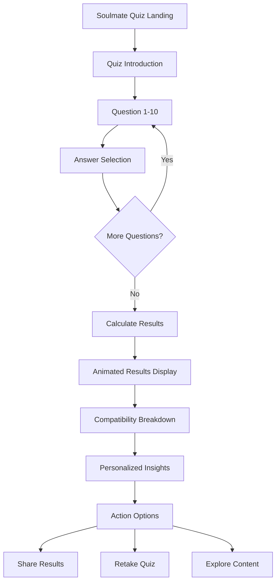

# Soulmate Quiz - Product Requirements Document

## 1. Product Overview

An interactive soulmate compatibility quiz that helps users discover their ideal partner characteristics and relationship compatibility patterns through a professionally designed assessment tool.

The quiz provides personalized insights into relationship preferences, compatibility factors, and soulmate characteristics, helping users better understand what they seek in meaningful romantic relationships and how to recognize compatible partners.

This feature expands the love language platform to include deeper relationship compatibility assessment, targeting users seeking long-term romantic connections and relationship guidance.

## 2. Core Features

### 2.1 User Roles

| Role | Registration Method | Core Permissions |
|------|---------------------|------------------|
| Quiz Participant | No registration required | Can take quiz, view results, share outcomes |
| Returning User | Browser local storage | Can retake quiz, access previous results |

### 2.2 Feature Module

Our soulmate quiz requirements consist of the following main pages:
1. **Soulmate Quiz Page**: Interactive questionnaire, progress tracking, question navigation
2. **Results Page**: Animated results display, compatibility breakdown, personalized insights
3. **Quiz Layout**: Consistent branding, navigation, responsive design

### 2.3 Page Details

| Page Name | Module Name | Feature description |
|-----------|-------------|---------------------|
| Soulmate Quiz Page | Question Interface | Display 10 professionally crafted questions with multiple choice answers, progress bar, navigation controls |
| Soulmate Quiz Page | Progress Tracking | Show current question number, completion percentage, visual progress indicator |
| Soulmate Quiz Page | Answer Selection | Interactive answer buttons with hover effects, answer validation, smooth transitions |
| Results Page | Results Display | Show primary soulmate type with animated reveal, detailed personality breakdown |
| Results Page | Compatibility Analysis | Display compatibility percentages with animated progress bars, detailed explanations |
| Results Page | Personalized Insights | Provide relationship tips, ideal partner characteristics, compatibility advice |
| Results Page | Social Sharing | Share results on social media, copy results to clipboard, invite others to take quiz |
| Results Page | Action Buttons | Retake quiz, explore related content, save results locally |
| Quiz Layout | Responsive Design | Mobile-first design, tablet optimization, desktop enhancement |
| Quiz Layout | Navigation | Consistent header/footer, breadcrumb navigation, smooth page transitions |

## 3. Core Process

**Main User Flow:**
1. User lands on soulmate quiz page from homepage or direct link
2. User reads quiz introduction and starts assessment
3. User progresses through 10 questions, selecting answers that resonate most
4. System calculates compatibility profile based on responses
5. User views animated results with detailed breakdown
6. User can share results, retake quiz, or explore related content

**Results Calculation Flow:**
1. System analyzes answer patterns across relationship dimensions
2. Determines primary soulmate compatibility type
3. Calculates percentage scores for different compatibility factors
4. Generates personalized insights and recommendations
5. Displays results with professional animations and visual elements

## 4. User Interface Design

### 4.1 Design Style

- **Primary Colors**: Rose (#f43f5e), Pink (#ec4899), Purple (#8b5cf6)
- **Secondary Colors**: Blue (#3b82f6), Emerald (#10b981), Amber (#f59e0b)
- **Button Style**: Rounded corners (8px), gradient backgrounds, subtle shadows, hover animations
- **Typography**: Inter font family, 16px base size, bold headings (24px-48px), readable line height (1.6)
- **Layout Style**: Card-based design, centered content, generous white space, mobile-first approach
- **Animation Style**: Smooth transitions (300ms), fade-in effects, progress animations, confetti celebrations
- **Icon Style**: Outline icons, heart and relationship themed emojis, consistent sizing (20px-24px)

### 4.2 Page Design Overview

| Page Name | Module Name | UI Elements |
|-----------|-------------|-------------|
| Soulmate Quiz Page | Question Interface | Large question text (24px), multiple choice buttons with hover states, gradient backgrounds, rounded corners |
| Soulmate Quiz Page | Progress Bar | Animated progress indicator, percentage display, rose gradient fill, smooth transitions |
| Results Page | Hero Section | Large celebration banner, animated trophy icon, gradient background, bold typography |
| Results Page | Results Cards | White cards with subtle shadows, rounded corners, gradient accents, animated percentage bars |
| Results Page | Action Buttons | Gradient button set, consistent spacing, icon integration, hover animations |
| Quiz Layout | Navigation | Clean header with logo, breadcrumb navigation, mobile hamburger menu |

### 4.3 Responsiveness

Desktop-first design with mobile optimization. Touch-friendly interface with minimum 44px touch targets. Responsive breakpoints at 768px (tablet) and 1024px (desktop). Optimized for both portrait and landscape orientations on mobile devices.