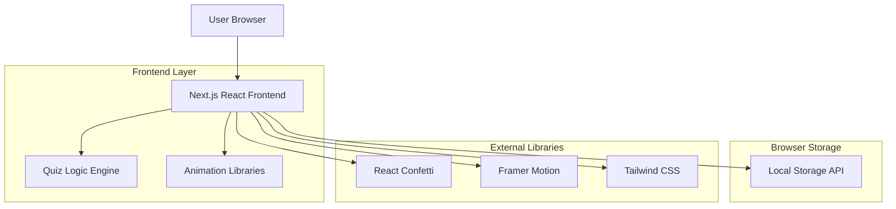
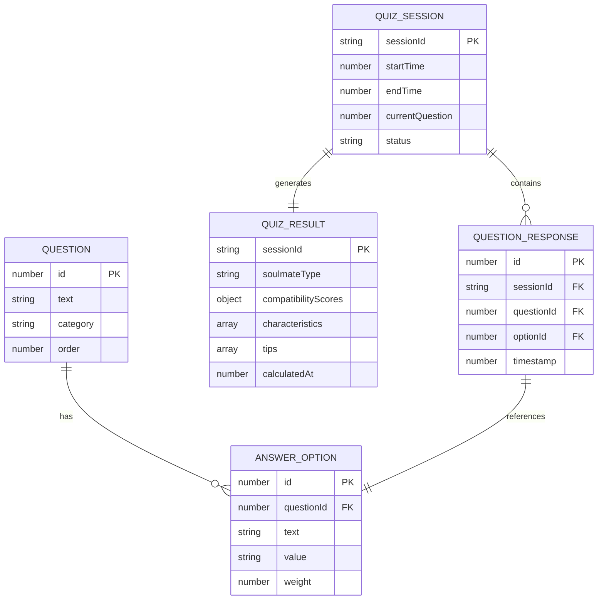

# Soulmate Quiz - Technical Architecture Document

## 1. Architecture Design



## 2. Technology Description

- Frontend: Next.js@14 + React@18 + TypeScript + Tailwind CSS@3
- Animation: Framer Motion + React Confetti
- Storage: Browser Local Storage
- Styling: Tailwind CSS with custom gradients
- Build Tool: Next.js built-in bundler

## 3. Route Definitions

| Route | Purpose |
|-------|---------|
| /soulmate | Soulmate quiz landing page with introduction and quiz interface |
| /soulmate/results | Results display page with animated compatibility breakdown |
| / | Homepage with navigation to soulmate quiz |

## 4. API Definitions

### 4.1 Core Data Types

Quiz Question Interface
```typescript
interface SoulmateQuestion {
  id: number;
  question: string;
  options: {
    text: string;
    value: string;
    weight: number;
  }[];
  category: 'communication' | 'values' | 'lifestyle' | 'emotional' | 'future';
}
```

Quiz Result Interface
```typescript
interface SoulmateResult {
  type: string;
  title: string;
  description: string;
  compatibility: {
    communication: number;
    emotional: number;
    lifestyle: number;
    values: number;
    future: number;
  };
  characteristics: string[];
  tips: string[];
  idealPartner: string[];
}
```

User Response Interface
```typescript
interface QuizResponse {
  questionId: number;
  selectedOption: string;
  weight: number;
  category: string;
}
```

### 4.2 Local Storage Schema

Quiz Progress Storage
```typescript
interface QuizProgress {
  currentQuestion: number;
  responses: QuizResponse[];
  startTime: number;
  lastUpdated: number;
}
```

Results Storage
```typescript
interface StoredResults {
  result: SoulmateResult;
  completionDate: number;
  totalTime: number;
  responses: QuizResponse[];
}
```

## 5. Data Model

### 5.1 Data Model Definition



### 5.2 Quiz Logic Implementation

Question Categories and Scoring
```typescript
// Question categories with weight distribution
const CATEGORY_WEIGHTS = {
  communication: 0.25,
  emotional: 0.25,
  lifestyle: 0.20,
  values: 0.20,
  future: 0.10
};

// Soulmate types based on score combinations
const SOULMATE_TYPES = {
  'romantic-idealist': {
    title: 'The Romantic Idealist',
    description: 'You seek deep emotional connection and shared dreams',
    minScores: { emotional: 80, communication: 70, values: 75 }
  },
  'practical-partner': {
    title: 'The Practical Partner',
    description: 'You value stability, compatibility, and shared goals',
    minScores: { lifestyle: 80, future: 75, values: 70 }
  },
  'adventurous-soul': {
    title: 'The Adventurous Soul',
    description: 'You desire excitement, growth, and shared experiences',
    minScores: { lifestyle: 75, communication: 70, emotional: 65 }
  },
  'deep-connector': {
    title: 'The Deep Connector',
    description: 'You prioritize emotional intimacy and understanding',
    minScores: { emotional: 85, communication: 80, values: 70 }
  },
  'balanced-seeker': {
    title: 'The Balanced Seeker',
    description: 'You seek harmony across all relationship dimensions',
    minScores: { communication: 70, emotional: 70, lifestyle: 70 }
  }
};
```

Result Calculation Algorithm
```typescript
function calculateSoulmateResult(responses: QuizResponse[]): SoulmateResult {
  // Calculate category scores
  const categoryScores = calculateCategoryScores(responses);
  
  // Determine soulmate type
  const soulmateType = determineSoulmateType(categoryScores);
  
  // Generate personalized insights
  const insights = generatePersonalizedInsights(categoryScores, soulmateType);
  
  return {
    type: soulmateType.key,
    title: soulmateType.title,
    description: soulmateType.description,
    compatibility: categoryScores,
    characteristics: insights.characteristics,
    tips: insights.tips,
    idealPartner: insights.idealPartner
  };
}
```